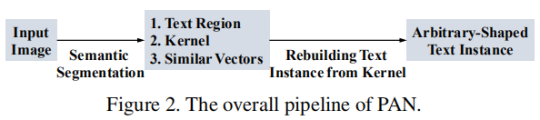
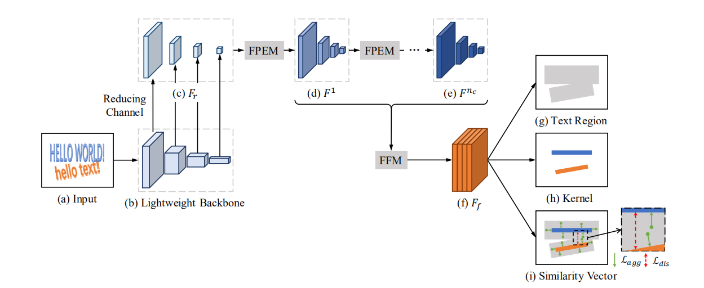
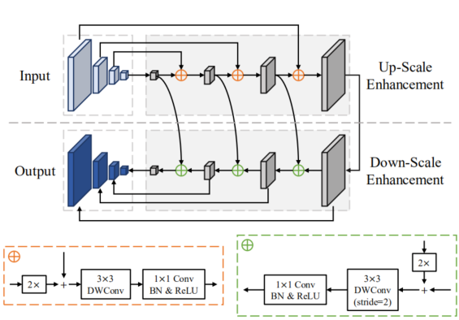

<h1 id='PANet'>PANet</h1>

>## 目录
+ [PANet简介](#Abstract)
+ [相关介绍](#Introduction)
+ [相关工作](#RelatedWork)
    + [1.总体架构]

><h2 id='Abstract'> PSENet简介 </h2>
[PANet](https://arxiv.org/pdf/1908.05900.pdf)全称为Pixel Aggregation Network，即像素聚合网络。它配备了低计算成本的分割头和可学习的后处理。分割头由特征金字塔模块(Feature Pyramid Enhancement Module, FPEM)和特征融合模块( Feature Fusion Module, FFM)组成。FPEM是一个可级联的U型模块，它可以引入多层次的信息来指导更好的分割。FFM可以将FPEM给出的不同深度的特征收集成最终的特征进行分割。可学习的后处理是由像素聚合( Pixel Aggregation，PA)实现的，它可以通过预测的相似性向量精确地聚合文本像素。

><h2 id='Introduction'> 相关介绍 </h2>
随着近年来基于CNN的目标检测和分割的发展，场景文本(scene text detection)检测取得了很大的进展。任意形状文本检测(Arbitrary-shaped text detection)是文本检测中最具挑战性的任务之一，也提出了检测曲线文本实例的新方法。但是大部分方法仍然存在缺陷：  
+ 推理速度低或复杂的后处理步骤从而限制了在现实环境中的部署
+ 具有高效率的文本检测器大多是为四边形文本实例设计的，它们在检测弯曲文本时存在缺陷

PANet是可以在速度与表现之间取得一个较好的平衡的任意形状的文本检测器，它拥有非常简单的流水线，仅仅只需两步：
+ 利用分割网络预测文本区域、核和相似度向量。
+ 从预测的内核中重建完整的文本实例

为了高效，我们需要减少这两个步骤的时间成本。首先，分割需要一个轻量级的主干,本文采用ResNet18作为PAN的默认主干网络。然而，轻量级主干在特征提取方面相对较弱，因此其特征通常具有较小的接受域和较弱的表示能力。为了弥补这一缺陷，我们提出了一个由两个模块组成的低计算成本的分割头：
+ FPEM：FPEM是一个由可分卷积构建的U形模块。因此，因此FPEM能够通过融合低级和高级信息和最小的计算开销来增强不同尺度的特征。此外，FPEM是可级联的，这允许我们通过在后面添加FPEM来补偿轻量级主干的深度。
+ FFM：为了收集低级和高级的语义信息，在最终分割之前引入了FFM来融合不同深度的FPEMs生成的特征
+ PA：为了准确地重建完整的文本实例，本文提出了一种可学习的后处理方法，即像素聚合(Pixel Aggregation， PA)，它可以引导文本像素通过预测的相似性向量来纠正内核

><h2 id='RelatedWork'> 相关工作 </h2>

近年来，基于深度学习的文本检测器取得了显著的效果。这些方法大多大致可分为两类：基于锚的方法和无锚的方法。
|  基于锚定的文本探测器   | 无锚文本探测器  | 实时文本检测
|  ----  | ----  | --- |
| Faster R-CNN  | PSENet | EAST|
|  SSD  | PixelLink | MCN|
| TextBoxes | EAST|
|TextBoxes++|DeepReg|
| RRD |TextSnake|
| SSTD | 
| RRPN | 
| SPCNet |
|Mask Text Spotter|
|Mask R-CNN|

><h2 id='RelatedWork'> 相关工作 </h2>
<h3 id='OverallArchitecture'>1.总体架构</h3>

本文采用轻量级模型(ResNet-18)作为PAN的主干网络。主干网络的conv2、conv3、conv4和conv5阶段生成四个特征图，并且他们相对输入图像的步长为4、8、16、32像素。我们使用1×1卷积，将每个特征映射的通道数减少到128，并得到一个薄的特征金字塔$Fr$。特征金字塔被$n_c$级联FPEM增强。每个FPEM产生一个增强的特征金字塔，因此有$n_c$增强的特征金字塔$F^1，F^2，...，F^{n_c}$。FFM将$n_c$增强的特征金字塔融合到一个特征地图$F_f$中，其步幅为4像素，通道数为512。$F_f$用于预测文本区域、核和相似度向量。最后，我们应用一种简单而高效的后处理算法来获得最终的文本实例。

<h3 id='FeaturePyramidEnhancementModule'>2.功能金字塔增强模块</h3>

FPEM是一个U型模块，它由向上增强和向下增强两个阶段组成。向上增强作用于输入特征金字塔。在此阶段中，在具有32、16、8、4像素步长的特征映射上迭代执行增强。在下行阶段，输入是由上行增强产生的特征金字塔，增强从4步到32步进行增强。
同时，向下尺度增强的输出特征金字塔是FPEM的最终输出。我们使用可分离卷积(separable convolution)（3×3 深度卷积(depthwise convolution)，然后是1×1投影(projection)），而不是用常规的卷积来构建FPEM的连接部分⊕(图像中虚线框）。因此，FPEM能够以较小的计算开销扩大接受域（3×3深度卷积)和深化网络(1×1卷积）